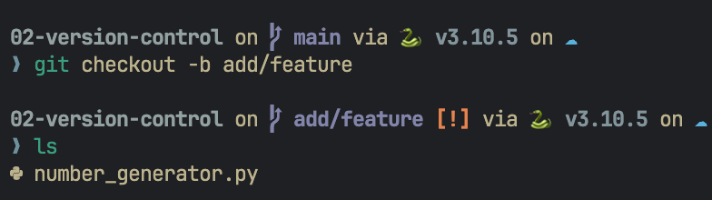
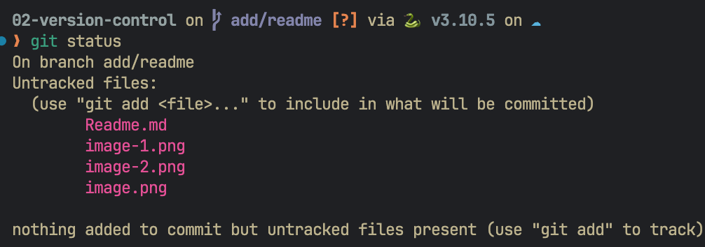
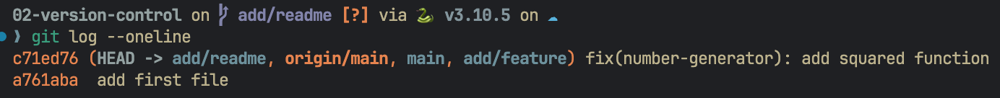
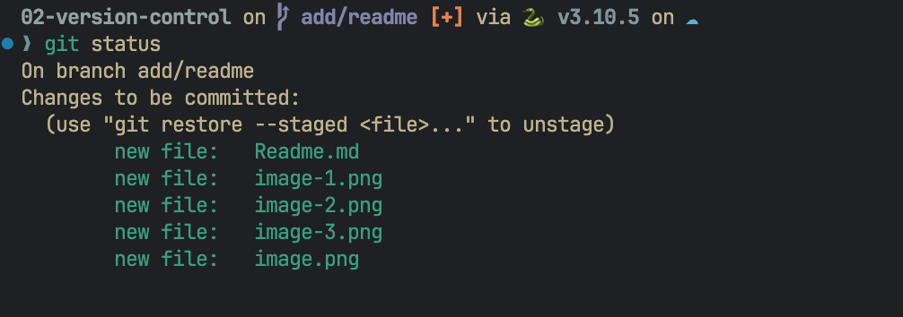
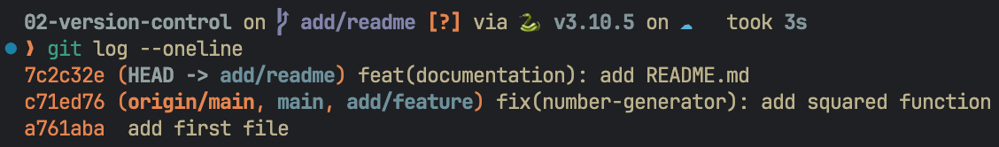
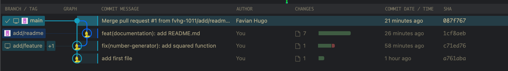

# Git 101

Within this Repository, I tried to setup basic repository in Git and heres the following command/steps that I used.

To put into context, I try to add README.MD from local branch(add/remote) to main branch  on remote repo (de-bcamp-git-exercise)  

1. git init -> to initializing local repo
2. git checkout -b add/readme -> changing branch for adding new feature

3. git status -> checking status (make sure if there are untracked files)

4. git log --oneline -> checking the previouses commits id 

5. git add . -> add content to staging 
6. git status -> checking status (make sure for filest that to be commited)

7. git commit -m "feat(documentation): add README.md" -> add commit in branch add/readme

from the picture above it can be seen that commited is success (but still the main is still one step behind)
8. git fetch --all && git rebase origin main -> make sure to update all branches before pushing to remote repo 
9. Make sure to accept the PR and right now And the gitlens is showing like this(which is there are no branch that conflict)
